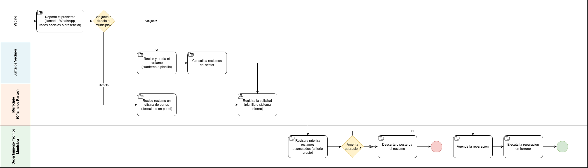

# Proceso de negocio — AS-IS

## Macro-proceso y proceso específico

Gestión municipal de infraestructura urbana → Recepción, priorización y resolución de reportes ciudadanos de problemas en la vía pública [ajustar si la comuna real usa otro nombre de macro-proceso]

## Objetivo de negocio del proceso

Canalizar los reportes de los vecinos sobre problemas en la vía pública (luminarias rotas, microbasurales, baches) hacia el municipio, para que este los priorice, asigne a un departamento técnico y ejecute la reparación correspondiente.

## Participantes y sus objetivos

| Participante | Objetivo en el proceso |
|---|---|
| Vecino | Que el problema reportado se solucione en un plazo razonable |
| Junta de vecinos / dirigente | Canalizar y representar los reclamos de su sector ante el municipio |
| Municipio — Oficina de Partes | Registrar formalmente la solicitud del vecino |
| Departamento Técnico Municipal (obras, aseo, alumbrado, etc.) | Evaluar, priorizar y ejecutar la reparación con los recursos disponibles |

## Diagrama AS-IS

Archivo fuente: [`./diagramas/as-is.drawio`](./diagramas/as-is.drawio.png)

El diagrama distingue tareas manuales (anotar en cuaderno, llenar formulario en papel, ejecutar en terreno) de una tarea de usuario (registrar la solicitud en una planilla o sistema interno), reflejando que hoy casi todo el proceso es manual y sin apoyo tecnológico.

## Problemas identificados

- No existe un canal único ni estandarizado de reporte: el vecino puede llamar, escribir por WhatsApp, publicar en redes sociales o ir presencialmente, lo que dispersa la información.
- No hay trazabilidad ni número de seguimiento para el vecino una vez que reporta.
- La priorización de reclamos depende del criterio subjetivo de quien revisa en el departamento técnico, sin datos objetivos de urgencia o impacto.
- No existe notificación de cambio de estado: el vecino no sabe si su reclamo fue recibido, descartado o resuelto.
- Reclamos duplicados de distintos vecinos sobre el mismo problema no se detectan ni se consolidan.
- [Agregar aquí cualquier problema adicional que surja de la elicitación real con un dirigente vecinal o funcionario municipal]
