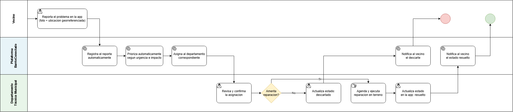

# Análisis de rediseño y propuesta TO-BE

## Mejoras identificadas por participante

| Participante | Objetivo | Problema | Mejora deseada |
|---|---|---|---|
| Vecino | Que el problema se solucione rápido | No hay canal único de reporte ni trazabilidad | Reportar desde una sola app y ver el estado en todo momento |
| Junta de vecinos / dirigente | Sentirse escuchado por el municipio | No recibe notificación del estado de su reclamo | Recibir notificaciones automáticas de cambio de estado |
| Departamento Técnico Municipal | Priorizar con criterios objetivos | Priorización subjetiva, sin datos | Priorización automática según urgencia e impacto |
| Municipio — Oficina de Partes | Registrar la solicitud sin errores ni reprocesos | Registro manual en papel o planillas dispersas | Registro automático de cada reporte apenas se envía |

## Iniciativas de rediseño

### Iniciativa 1 — Canal único de reporte digital

- Actividad(es) del AS-IS que afecta: "Reporta el problema (llamada, WhatsApp, redes sociales o presencial)"
- Heurística aplicada: eliminación de canales redundantes / integración de tareas
- Objetivo o mejora que resuelve: canal único y estandarizado para el vecino
- Efecto esperado (tiempo/costo/calidad/flexibilidad): Simplicar procesos que constan de varios actores, a su vez optimizando pasos.

### Iniciativa 2 — Registro y priorización automática

- Actividad(es) del AS-IS que afecta: "Recibe y anota el reclamo" / "Registra la solicitud" / "Revisa y prioriza reclamos acumulados"
- Heurística aplicada: automatización de tareas (paso de tarea manual a tarea de servicio)
- Objetivo o mejora que resuelve: priorización objetiva y sin reprocesos de registro
- Efecto esperado (tiempo/costo/calidad/flexibilidad): Garantiza al usuario una respuesta directa y el estado del reclamo.

### Iniciativa 3 — Notificación de estado al vecino

- Actividad(es) del AS-IS que afecta: ausencia de retroalimentación al vecino tras reportar
- Heurística aplicada: incorporación de control (visibilidad del estado del proceso para el cliente)
- Objetivo o mejora que resuelve: el vecino se entera del estado de su reclamo sin tener que volver a consultar
- Efecto esperado (tiempo/costo/calidad/flexibilidad): Mejora en la percepción de calidad del servicio municipal.

## Diagrama TO-BE

Archivo fuente: [`./diagramas/to-be.drawio`](./diagramas/to-be.drawio.png)

El diagrama incorpora la lane "Plataforma BarrioConectado", que concentra las tareas de servicio (registro, priorización, asignación y notificación automáticas), reemplazando gran parte del trabajo manual del AS-IS. La ejecución física de la reparación en terreno se mantiene como tarea manual, ya que sigue requiriendo intervención humana.

| Actividad en el AS-IS | Actividad en el TO-BE | Qué cambia |
|---|---|---|
| Reporta el problema (llamada, WhatsApp, redes, presencial) | Reporta el problema en la app (foto + ubicación georreferenciada) | Canal único y estandarizado |
| Recibe y anota el reclamo (Junta) / Recibe formulario en papel (Municipio) | Registra el reporte automáticamente | Elimina duplicación de canales y de registro manual |
| Revisa y prioriza reclamos acumulados (criterio propio) | Prioriza automáticamente según urgencia e impacto | Priorización objetiva y basada en datos |
| Sin actividad equivalente | Notifica al vecino el descarte / Notifica al vecino el estado resuelto | Trazabilidad y visibilidad para el vecino |
| Revisa y prioriza reclamos acumulados (sin asignación formal) | Asigna al departamento correspondiente / Revisa y confirma la asignación | Asignación por categoría con confirmación del administrador |
| Descarta o posterga el reclamo / Ejecuta la reparación sin registro del cierre | Actualiza estado: descartado / Actualiza estado en la app: resuelto | Cierre registrado con nota y visible para el vecino |

Esta tabla es la que se usa en `03-requisitos.md` y `04-historias-usuario.md` para asociar cada requisito e historia a la actividad que cambia.
